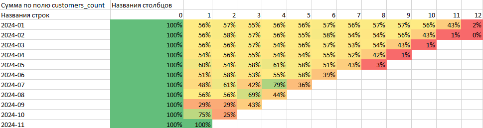

# Когортный анализ удержания клиентов Ozon

## Описание проекта

Целью проекта было изучение поведения клиентов маркетплейса Ozon после их первой покупки.  
Анализ позволил оценить, как долго пользователи остаются активными и на каких этапах происходит отток.

Работа выполнена на реальных данных о заказах, обработанных с помощью SQL и Excel.

## Этапы работы

- Вычислена дата первой покупки для каждого клиента.
- Сформированы когорты по месяцу первой покупки.
- Для каждой когорты рассчитан процент клиентов, совершивших заказы в последующие месяцы.
- Построена тепловая карта удержания для наглядного отображения результатов.

## Краткие выводы

- У большинства когорт наблюдается закономерное снижение активности с каждым месяцем.
- Самые высокие показатели удержания фиксируются в первый месяц после первой покупки.
- Далее происходит постепенный спад, особенно заметный на 3–4 месяцах.

## Рекомендации на основе анализа

- Рассмотреть запуск специальных предложений в течение первых 1–2 месяцев после первой покупки, чтобы повысить вероятность повторных заказов.
- Упрощать процесс повторной покупки для клиентов, сделавших один заказ, через персонализированные напоминания или рассылки.
- Отдельно проанализировать когорты с наиболее резким падением удержания для выявления возможных проблем в ассортименте или сервисе.
- Разработать отдельные стратегии работы с клиентами, которые продолжают заказывать после третьего месяца — они показывают высокий уровень лояльности и могут быть основой для программ лояльности.

## Использованные инструменты

- **SQLite** (работа через DBeaver) — построение запросов и обработка данных.
- **Excel** — расчёт retention-процентов и построение тепловой карты.
- **GitHub** — для хранения итогового проекта.

## Структура проекта

- `/sql/` — SQL-запрос для формирования когортной таблицы.
- `/img/` — готовая тепловая карта retention.
- `/data/` — (опционально) пример исходных данных.
- `README.md` — описание проекта.

## Визуализация результата

Тепловая карта показывает, как меняется активность клиентов по когортам:  
от зелёного цвета (высокое удержание) к красному (сильный отток).

